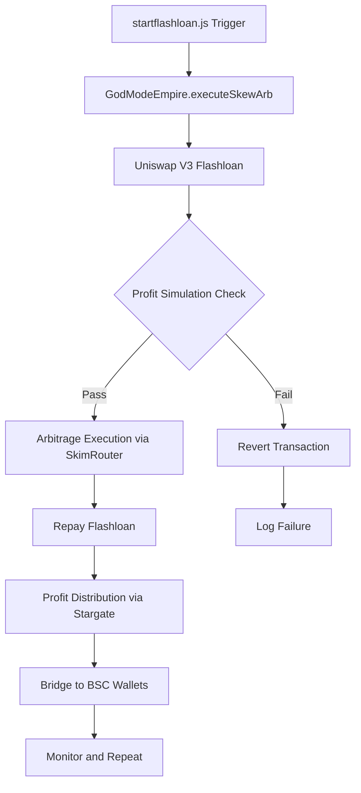

# Comprehensive Arbitrage Strategy for GodModeEmpire Framework

## Overview
This strategy integrates GodModeEmpire, SkimRouter, and startflashloan.js to execute profitable arbitrage on Arbitrum, mitigating key risks through enhanced risk management, secure integrations, and automated monitoring.

## Current Integration Analysis
- **GodModeEmpire**: Core contract handling flashloans, arbitrage modes (skewed, triangular, liquid, cross-pool, advanced), swaps via Uniswap V3, profit distribution via Stargate bridging.
- **SkimRouter**: Fee-collecting wrapper for Uniswap swaps, generating revenue (0.05% default fee).
- **startflashloan.js**: Hardhat script triggering skewed arbitrage with hardcoded parameters.
- **Risk Exposure**: Flashloan failures, slippage, vulnerabilities, gas costs, oracle dependencies.

## Risk Mitigations

### 1. Flashloan Failure
- **Mitigation**: Implement pre-execution profit simulations in Hardhat to ensure net profit exceeds 1% above fees. Revert if insufficient.
- **Integration**: Modify GodModeEmpire's callback to calculate expected profit before swaps. Use SkimRouter for swaps to offset fees via revenue.
- **Implementation**: Add `_simulateProfit()` function in GodModeEmpire estimating output using oracles and slippage.

### 2. Slippage and Price Volatility
- **Mitigation**: Use Chainlink oracles as primary, fallback to Uniswap TWAP for validation. Add 0.5-1% slippage tolerance. Monitor volatility via price deviation thresholds; abort during high volatility.
- **Integration**: Enhance `_getMarketPrice()` in GodModeEmpire with TWAP integration. Add volatility check using historical price data.
- **Implementation**: Integrate Uniswap's IQuoter for TWAP quotes.

### 3. Smart Contract Vulnerabilities
- **Mitigation**: Conduct audits for reentrancy, overflow. Use OpenZeppelin's SafeERC20 and ReentrancyGuard (already in place). Integrate SkimRouter as secure wrapper.
- **Integration**: Ensure all external calls use safe libraries. Add timelocks for critical functions.
- **Implementation**: Review and update GodModeEmpire for any missing guards.

### 4. Gas and Bridge Costs
- **Mitigation**: Batch transactions, execute during low-fee periods. For Stargate, add retry logic or alternative bridging (e.g., via LayerZero directly).
- **Integration**: Calculate net profit post-gas in callback. Reserve buffer for fees.
- **Implementation**: Modify profit distribution to account for estimated gas costs.

### 5. Oracle Dependencies
- **Mitigation**: For oracle-less tokens (PEPE, BONK), fetch prices from multiple DEXs (Uniswap, SushiSwap) using multicall. Use aggregators or off-chain keepers.
- **Integration**: Replace 1:1 assumption with dynamic fetching in `_getMarketPrice()`.
- **Implementation**: Add `_fetchDexPrice()` function querying multiple pools.

## Integration Enhancements
- **SkimRouter Integration**: Replace direct Uniswap swaps in GodModeEmpire with SkimRouter calls to generate fee revenue, offsetting operational costs.
- **startflashloan.js Enhancement**: Make parameters dynamic (via config.js or env), add error handling, integrate risk checks (e.g., volatility monitoring), and automate execution with keepers.

## Profitable Path Routing
- **Routing Logic**: Prioritize paths with highest expected profit post-fees. Use triangular/cross-pool routes for complex arbitrage.
- **Automation**: Leverage empire-ai.js for AI-driven path selection based on real-time data.
- **Monitoring**: Implement on-chain oracles and off-chain alerts for anomalies.

## Hardhat Integration
- **Simulations**: Use Hardhat for pre-deployment simulations of arbitrage scenarios.
- **Tests**: Create comprehensive tests for each risk mitigation.
- **Deployment**: Secure scripting with environment variables for sensitive data.

## Arbitrage Workflow Diagram

## Implementation Plan
1. Update GodModeEmpire contract with mitigations.
2. Integrate SkimRouter into swaps.
3. Enhance startflashloan.js.
4. Develop Hardhat tests.
5. Deploy and monitor on Arbitrum testnet.

## Conclusion
This strategy ensures robust, profitable arbitrage by addressing risks systematically, leveraging existing tools for secure execution.